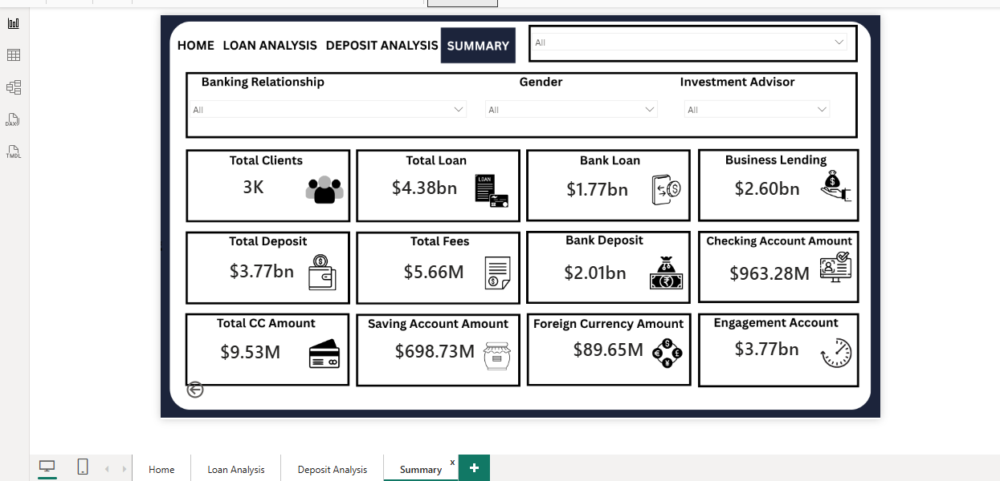

# 📊 Banking Customer Analytics Dashboard

> An end-to-end Business Intelligence project that transforms raw banking customer data into actionable insights using **Python, SQL, Power Query, DAX and Power BI**.

---

## 📌 Project Overview

The **Banking Customer Analytics Dashboard** is an interactive Power BI project designed to analyze customer demographics, deposits, loans, income, and banking relationships. The project follows a complete analytics workflow from data cleaning and exploratory analysis to dashboard development helping stakeholders make data-driven decisions.

---

## 🎯 Objectives

- Analyze customer demographics and banking behavior.
- Monitor deposits, loans, and customer income.
- Track key business KPIs.
- Build an interactive dashboard for business users.
- Generate actionable insights to support decision-making.

---

## 🛠️ Tools & Technologies

| Tool | Purpose |
|------|---------|
| **Power BI** | Dashboard Development |
| **Power Query** | Data Cleaning & Transformation |
| **DAX** | KPI Calculations & Measures |
| **Python** | Exploratory Data Analysis (EDA) |
| **SQL** | Data Querying & Validation |
| **Excel/CSV** | Source Dataset |

---

## 📂 Repository Structure

```
Banking-Customer-Analytics-Dashboard
│
├── Dashboard
│   └── Banking Dashboard.pbix
│
├── Dataset
│   └── customer.csv
│
├── Python
│   └── BankEDA.ipynb
│
├── SQL
│   ├── schema.sql
│   └── queries.sql
│
├── Images
│   ├── Home.png
│   ├── Loan_Analysis.png
│   ├── Deposit_Analysis.png
│   └── Summary.png
│
└── README.md
```

---

# 📊 Dashboard Pages

### 🏠 Home Dashboard

The Home page provides an executive overview of the banking dataset with key performance indicators and customer insights.

**Features**

- Total Customers
- Total Deposits
- Total Loans
- Average Income
- Average Fees
- Gender Analysis
- Banking Relationship Analysis
- Interactive Filters

---

### 💳 Loan Analysis

Provides a detailed analysis of customer lending behavior.

**Features**

- Total Loan Amount
- Loan by Occupation
- Loan by Nationality
- Loan Distribution
- Loan Trends
- Customer Loan Analysis

---

### 💰 Deposit Analysis

Focuses on customer deposits and savings.

**Features**

- Total Deposits
- Savings Analysis
- Checking Account Analysis
- Foreign Currency Deposits
- Deposit by Customer Segment
- Deposit Trends

---

### 📈 Summary Dashboard

Provides an executive summary of the overall banking performance.

**Features**

- Overall KPIs
- Customer Segmentation
- Loan vs Deposit Comparison
- Business Insights
- Executive Summary

---

# 📈 Key Performance Indicators (KPIs)

- Total Customers
- Total Loans
- Total Deposits
- Average Customer Income
- Average Deposit per Customer
- Loan-to-Deposit Ratio
- Credit Card Balance
- Average Banking Fees
- Banking Relationship Count

---

# 💡 Key Insights

- Deposits exceeded total loans, indicating strong liquidity.
- High-income customers maintained significantly higher deposit balances.
- Professionals contributed the largest share of loan amounts.
- Customer demographics influenced banking product adoption.
- Premium customers generated the highest average deposits.
- The Loan-to-Deposit Ratio provides insight into lending efficiency.

---

# 📷 Dashboard Preview

## 🏠 Home Dashboard


---

## 💳 Loan Analysis


---

## 💰 Deposit Analysis


---

## 📈 Summary Dashboard



---

# 🔄 Project Workflow

```
Raw Dataset
      │
      ▼
Python (EDA & Data Cleaning)
      │
      ▼
SQL Analysis
      │
      ▼
Power Query
      │
      ▼
Power BI
      │
      ▼
DAX Measures
      │
      ▼
Interactive Dashboard
```

---

# ⭐ Project Highlights

- End-to-End Data Analytics Project
- Interactive Multi-Page Power BI Dashboard
- Data Cleaning using Python & Power Query
- SQL-Based Data Analysis
- Advanced DAX Measures
- Executive-Level KPI Dashboard
- Business Insight Generation
- Interactive Filtering & Navigation

---

# 🚀 How to Use

1. Clone this repository.
2. Open the `.pbix` file in **Power BI Desktop**.
3. Refresh the dataset if required.
4. Explore the dashboard using slicers and interactive visuals.

---

# 📌 Future Enhancements

- Customer Churn Prediction
- Loan Default Risk Analysis
- Time-Series Forecasting
- Automated Data Refresh
- Drill-through Reports
- AI-powered Insights

---

# 👩‍💻 Author

**Naaz**

B.Tech in Electronics & Communication Engineering

**Skills:** Power BI • SQL • Python • Data Analytics • Machine Learning • DAX • Power Query

---

## ⭐ If you found this project helpful, please consider giving it a Star!
